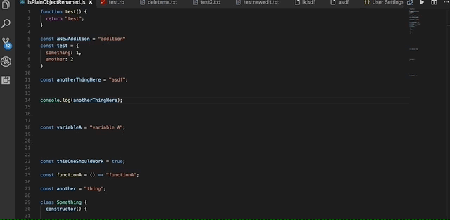

# vscode-goto-next-previous-member

Visual Studio Code Extension to navigate through the functions, variables, and classes using quick and easy keycommands similar to functionality provided by IntelliJ IDE's (next/previous function) or Resharper (next/previous member)

## Features

This Extension provides two key commands to navigate up and down through the members in your file.



## Requirements

vscode@1.28.0+

## Commands and Settings

### Commands

This extension provides the following commands that can be used in keyboard shortcuts:

| Command                                      | Description               | Default Shortcut |
| -------------------------------------------- |:------------------------- | :---------------|
| `gotoNextPreviousMember.previousMember`      | Move To Previous Member   | ctrl+up         |
| `gotoNextPreviousMember.nextMember`          | Move To Next Member       | ctrl+down       |

You can customize these commands in your `keybindings.json` to target specific symbol types. For example:

```json
{
    "key": "ctrl+shift+up",
    "command": "gotoNextPreviousMember.previousMember",
    "args": ["function", "method"]
}
```

### Settings

This extension provides the following settings that can be configured in your `settings.json`:

1. `gotoNextPreviousMember.symbolKinds` (default: `[]` - all symbols included)
   - An array of symbol types to include when navigating
   - When empty or not set, all symbol types are included
   - Example setting:

   ```json
   {
       "gotoNextPreviousMember.symbolKinds": ["function", "class", "method"]
   }
   ```

   Available symbol types:

   | Symbol Kind     |
   | --------------- |
   | "array"         |
   | "boolean"       |
   | "class"         |
   | "constant"      |
   | "constructor"   |
   | "enum"          |
   | "enummember"    |
   | "event"         |
   | "field"         |
   | "file"          |
   | "function"      |
   | "interface"     |
   | "key"           |
   | "method"        |
   | "module"        |
   | "namespace"     |
   | "null"          |
   | "number"        |
   | "object"        |
   | "operator"      |
   | "package"       |
   | "property"      |
   | "string"        |
   | "struct"        |
   | "typeparameter" |
   | "variable"      |

2. `gotoNextPreviousMember.selectEntireSymbol` (default: `false`)
   - Determines whether to select the entire symbol when navigating
   - Example setting:

   ```json
   {
       "gotoNextPreviousMember.selectEntireSymbol": true
   }
   ```

   - When `true`: The entire symbol will be selected when navigating
   - When `false`: Only the cursor will be moved to the start of the symbol

## Language Support

For the outline to work, the language support plugins need to support symbol information.

For the outline to form a tree structure, the language support plugins need to report the entire definition range as part of symbol.

See VS Code [issue #34968](https://github.com/Microsoft/vscode/issues/34968) and language server protocol [issue #132](https://github.com/Microsoft/language-server-protocol/issues/132) for a discussion.

Here is a list of languages known to work with Code Outline:

| Language/Format | Extension |
| --- | --- |
| C | [C/C++](https://marketplace.visualstudio.com/items?itemName=ms-vscode.cpptools) |
| C++ | [C/C++](https://marketplace.visualstudio.com/items?itemName=ms-vscode.cpptools), [cquery](https://github.com/cquery-project/vscode-cquery) |
| Docker | [Docker](https://marketplace.visualstudio.com/items?itemName=PeterJausovec.vscode-docker) |
| HTML | Comes with VS Code |
| JavaScript | Comes with VS Code |
| JSON | Comes with VS Code |
| Markdown | Comes with VS Code |
| ruby |  [Ruby Symbols](https://marketplace.visualstudio.com/items?itemName=miguel-savignano.ruby-symbols) |
| Perl | [Perl](https://marketplace.visualstudio.com/items?itemName=henriiik.vscode-perl) |
| PHP | [PHP Symbols](https://marketplace.visualstudio.com/items?itemName=linyang95.php-symbols) |
| Python | [Python](https://marketplace.visualstudio.com/items?itemName=ms-python.python) |
| TypeScript | Comes with VS Code |
| YAML | [YAML Support by Red Hat](https://marketplace.visualstudio.com/items?itemName=redhat.vscode-yaml) |

Please report any missing extensions and I'll update the list.

## Known Issues

If you are experiencing no movement upon running the command:

I have observed an issue with the Visual Studio API to return symbols from `vscode.executeDocumentSymbolProvider`. One way I have found to possibly fix the issue is to disable all extensions, restart Visual Studio and then enable all extensions and restart again.

Possible Related Issue:
[https://github.com/OmniSharp/omnisharp-vscode/issues/2192](https://github.com/OmniSharp/omnisharp-vscode/issues/2192)

## Release Notes

See [CHANGELOG.md](CHANGELOG.md)

---------------------------------------------------------------------------------------

### More Visual Studio Code Extensions by `mishkinf`

#### [Visual Studio Code Navigate Edits History - Goto Last Edit](https://github.com/mishkinf/vscode-edits-history)

  A Visual Studio Extension that provides the ability to quickly navigate back and forth between recently made edits

**Enjoy!**

## License

MIT

Permission is hereby granted, free of charge, to any person obtaining a copy of this software and associated documentation files (the "Software"), to deal in the Software without restriction, including without limitation the rights to use, copy, modify, merge, publish, distribute, sublicense, and/or sell copies of the Software, and to permit persons to whom the Software is furnished to do so, subject to the following conditions:

The above copyright notice and this permission notice shall be included in all copies or substantial portions of the Software.

THE SOFTWARE IS PROVIDED "AS IS", WITHOUT WARRANTY OF ANY KIND, EXPRESS OR IMPLIED, INCLUDING BUT NOT LIMITED TO THE WARRANTIES OF MERCHANTABILITY, FITNESS FOR A PARTICULAR PURPOSE AND NONINFRINGEMENT. IN NO EVENT SHALL THE AUTHORS OR COPYRIGHT HOLDERS BE LIABLE FOR ANY CLAIM, DAMAGES OR OTHER LIABILITY, WHETHER IN AN ACTION OF CONTRACT, TORT OR OTHERWISE, ARISING FROM, OUT OF OR IN CONNECTION WITH THE SOFTWARE OR THE USE OR OTHER DEALINGS IN THE SOFTWARE.
